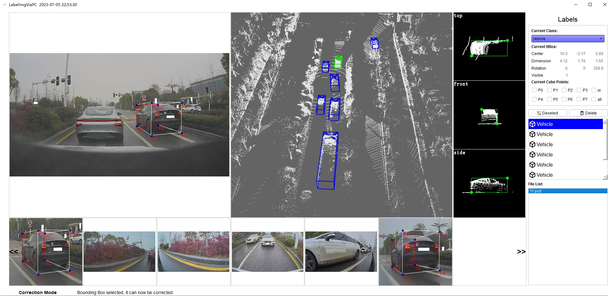

# LabelImgViaPC

Label Image via point cloud, not free but cheap

## Introduction

LabelImgViaPC is a tool for labeling images using lidar point cloud. The main principle is to label three-dimensional objects (cubes) on the point cloud, and obtain the target information on the images through the mapping relationship between the point cloud and the images. This software supports adjusting 3D targets through perspective views. Due to the frequent mismatch between point clouds and images, this software supports adjusting the mapping points on the image (3D targets remain unchanged)

    

## Tools

| Tool                     | Download | key |
| ------------------------ | ------- |  ------- |
| LabelImgViaPC            | [Baidu](https://pan.baidu.com/s/1J7kckd2WT955ciGHnDcb8w)   | fk0v
| LabelImgViaPC            | [Google](https://drive.google.com/drive/folders/1dj_oOje4q2ArElcnZlssxCtG5W8YE04R?usp=drive_link) | 

## Usage

See docs/

Pay attention to modifying the path in the configuration file before running

## Contact

E-mail: kj.qiu@hotmail.com

QQ群: 837313013

